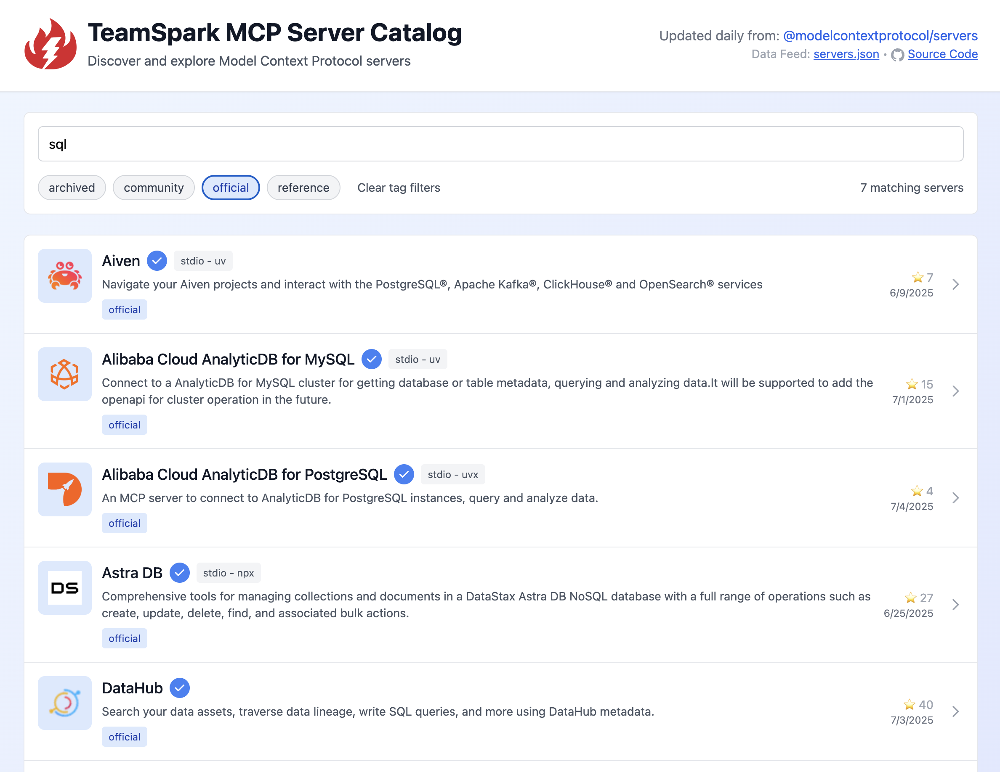
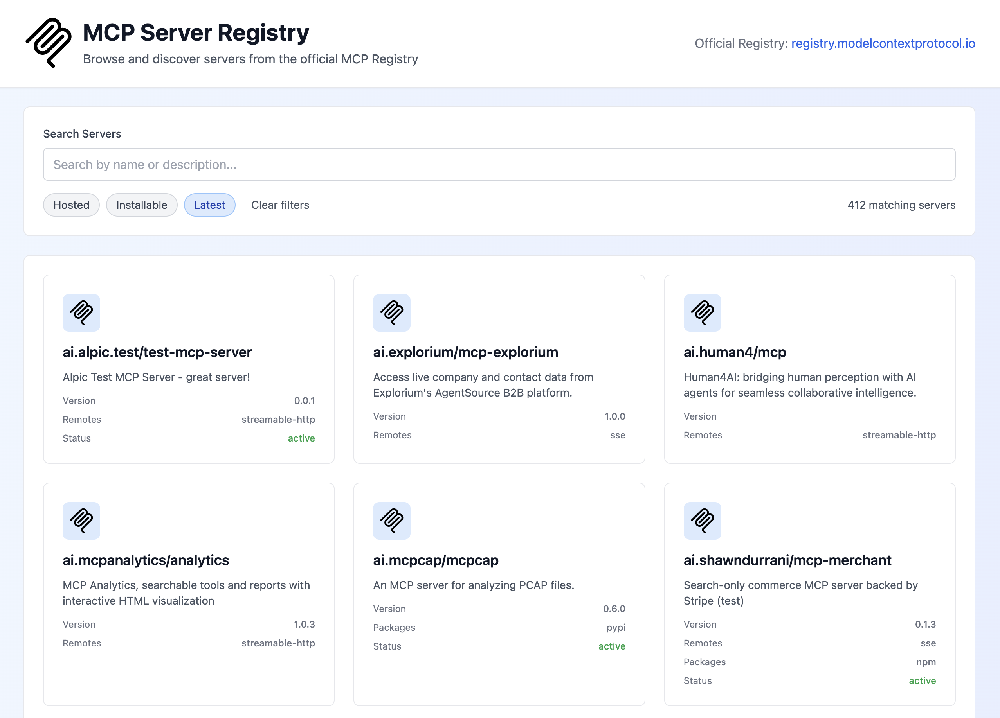

# TeamSpark MCP Server Discovery

[TeamSpark MCP Server Discovery](https://teamsparkai.github.io/ToolCatalog/) is a GitHub Pages site in this repo that provides two discovery methods:

- **[Server Catalog](https://teamsparkai.github.io/ToolCatalog/catalog)** - A curated collection of MCP servers from [@modelcontextprotocol/servers](https://github.com/modelcontextprotocol/servers/) with enhanced metadata and configuration examples
- **[Server Registry](https://teamsparkai.github.io/ToolCatalog/registry)** - The complete official MCP server registry from [registry.modelcontextprotocol.io](https://registry.modelcontextprotocol.io)

Both interfaces allow users to search, filter, and explore MCP servers, including links to their repositories and sample server configurations that can be easily copied.

## Curated Server Catalog

The curated catalog uses a scheduled GitHub Action to do daily processing of the [@modelcontextprotocol/servers](https://github.com/modelcontextprotocol/servers/) repo README.md file to get the list of MCP servers found there (extracting metadata, including tags based on the section each server is listed in). It then validates the GitHub repo for each server hosted on GitHub (most of them), including getting repo metadata and parsing the repo README to extract sample configuration. The result is the [servers.json](./public/servers.json) file that can be found in this repo.



For more technical details, see: [scripts/catalog/README.md](/scripts/catalog/README.md).

## MCP Server Registry

The registry integration provides direct access to the official MCP server registry, allowing users to browse the complete list of registered MCP servers. A scheduled GitHub Action downloads the registry data daily and saves it as [server-registry.json](./public/server-registry.json) for static hosting compatibility.



## Embedding the Catalog in Your Own App

The servers.json file is intended to be embedded in websites or applications that wish to deliver a catalog of MCP servers for their users to choose from.

The servers.json file contains a list of servers in the following form:

```json
{
    "id": "agentql:bdfc4aff",
    "icon": "https://www.agentql.com/favicon/favicon.png",
    "name": "AgentQL",
    "description": "Enable AI agents to get structured data from unstructured web with AgentQL.",
    "repository": {
        "url": "https://github.com/tinyfish-io/agentql-mcp",
        "source": "github",
        "stars": 82,
        "lastUpdated": "2025-07-01T23:14:41Z"
    },
    "tags": [
        "official"
    ],
    "serverName": "agentql",
    "serverConfig": {
        "type": "stdio",
        "command": "npx",
        "args": [
            "-y",
            "agentql-mcp"
        ],
        "env": {
            "AGENTQL_API_KEY": "YOUR_API_KEY"
        }
    }
}
```

**Note on server id:** The id field is generated from the server name (lowercased and cleaned up) and the first 8 characters of the sha256 hash of the repo, separated by a colon. This produces an ID that is human readable, unique, persistent, and safe to use in filesystem paths or URLs.

### What about the icons?

The icon URLs in the servers.json file are the exact URLs from the source. That being said, you should not use these URLs directly in web pages or browser controls in your app, as many of them will have CORS or CORB issues (and it would be generally frowned upon to use most of those image links in that way). Some of the icon paths are GitHub URLs that need to be adapted to the raw images. In all cases, you should only use the icon URLs to either proxy or download the images and you should host/serve them directly. For example, this repo downloads the images and serves them directly (using a servers-local.json file with references to the local icon files). Note that in the source page (at the original repo) these images are served by GitHub which proxies (and caches/optimizes) image access.
